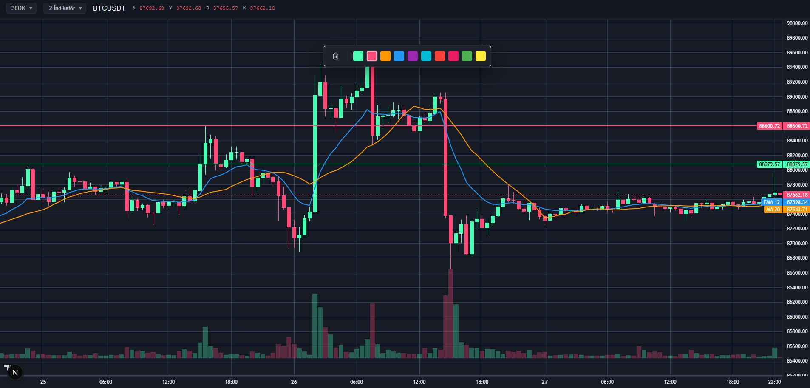

# Koin Grafik - Binance Kripto Grafik Modülü

Modern React, Next.js 15+ ve TypeScript kullanılarak geliştirilmiş, **plug-and-play** bir Binance kripto para grafik modülüdür. TradingView benzeri bir arayüze sahiptir ve yatay çizgi ekleme, indikatörler, gerçek zamanlı veri güncellemeleri, OHLC veri gösterimi ve özelleştirilebilir crosshair çizgileri gibi özellikler sunar.

Bu modül, **başka bir Next.js projesine kolayca dahil edilebilen** self-contained (kendine yeten) bir yapıya sahiptir. Tüm internal implementasyon detayları gizlidir ve sadece `TradingChartModule` component'ini import edip kullanmanız yeterlidir.

## 📁 Klasör Yapısı

Proje **Feature-Based Architecture** ve **Next.js App Router** yapısına göre organize edilmiştir:

```
src/
├── app/                          # Next.js App Router
│   ├── layout.tsx               # Root layout
│   ├── page.tsx                 # Ana sayfa
│   └── page.module.css          # Page styles
│
├── features/                     # Feature modülleri
│   └── trading/                 # Trading/Chart modülü (PLUG-AND-PLAY)
│       ├── components/          # Chart bileşenleri
│       │   ├── Chart.tsx        # Ana chart component
│       │   ├── TradingChartModule.tsx  # Main public component
│       │   ├── ErrorOverlay.tsx
│       │   ├── LoadingOverlay.tsx
│       │   ├── CrosshairLabels.tsx
│       │   ├── LineContextMenu.tsx
│       │   └── widgets/         # Trading-specific widgets
│       │       ├── DropdownWidget.tsx
│       │       ├── IntervalSelectorWidget.tsx
│       │       ├── IndicatorSelectorWidget.tsx
│       │       ├── SymbolAndOHLCWidget.tsx
│       │       └── index.ts
│       ├── hooks/               # Chart hook'ları
│       │   ├── useBinanceData.ts
│       │   ├── useChartData.ts
│       │   ├── useChartIndicators.ts
│       │   ├── useChartInitialization.ts
│       │   ├── useChartLines.ts
│       │   ├── useChartLineInteraction.ts
│       │   ├── useChartMouseInteraction.ts
│       │   ├── useChartVolume.ts
│       │   ├── useContainerSize.ts
│       │   ├── useCrosshair.ts
│       │   └── useHoveredBarData.ts
│       ├── services/            # API servisleri
│       │   └── binance.ts      # Binance API & WebSocket
│       ├── types/               # TypeScript tipleri
│       │   ├── binance.ts
│       │   ├── config.ts
│       │   ├── indicators.ts
│       │   ├── lines.ts
│       │   └── ohlc.ts
│       ├── utils/               # Yardımcı fonksiyonlar
│       │   ├── indicators.ts
│       │   └── ohlc.ts
│       ├── constants.ts         # Chart sabitleri
│       └── index.ts            # Public API (barrel export)
│
└── constants/                   # Global sabitler
    └── index.ts                # UI_COLORS, UI_CONFIG
```

**Önemli:** `src/features/trading/` modülü tamamen **self-contained** (kendine yeten) bir yapıdadır. Bu klasörü başka bir projeye kopyaladığınızda, sadece `index.ts` dosyasından export edilen `TradingChartModule` component'ini kullanmanız yeterlidir.

## 🚀 Kurulum

### Gereksinimler

- **Node.js**: `18.0.0` veya üzeri
- **npm**: `9.0.0` veya üzeri (veya `yarn` / `pnpm`)

Sürümünüzü kontrol etmek için:
```bash
node --version
npm --version
```

### Bağımlılıkları Yükleme

```bash
npm install
```

veya

```bash
npm install --legacy-peer-deps
```

## ▶️ Başlatma

### Geliştirme Modu

```bash
npm run dev
```

Uygulama varsayılan olarak `http://localhost:3000` adresinde çalışacaktır.

### Production Build

```bash
# Production build oluşturma
npm run build

# Build'i çalıştırma
npm start
```

### Diğer Komutlar

```bash
# ESLint kontrolü
npm run lint
```

## 🛠️ Teknolojiler

- **Next.js 15.1.0** - React framework (App Router)
- **React 19.2.0** - UI library
- **TypeScript 5.9.3** - Type safety
- **lightweight-charts 5.1.0** - Charting library
- **Material-UI (MUI) 6.1.0** - UI component library
- **Emotion** - CSS-in-JS styling

## 📝 Notlar

- Proje **Next.js App Router** kullanıyor
- Tüm interaktif component'ler `'use client'` direktifi ile işaretlenmiş
- Chart component dynamic import ile yükleniyor (SSR disabled)
- Import path'leri `@/` alias kullanıyor (tsconfig.json'da tanımlı)
- Modül **plug-and-play** yapıdadır, başka projelere kolayca entegre edilebilir
- Gerçek zamanlı veri güncellemeleri WebSocket üzerinden yapılıyor
- Horizontal line'lar interval değişikliklerinde korunur
- Crosshair çizgileri mouse pointer'ı takip eder
- OHLC verileri bar rengine göre dinamik olarak renklendirilir

## 📸 Ekran Görüntüsü



---

**Lisans:** Bu proje özel bir projedir.
